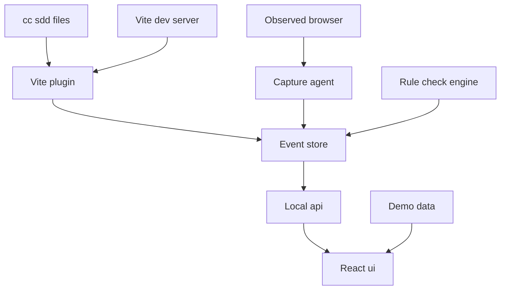
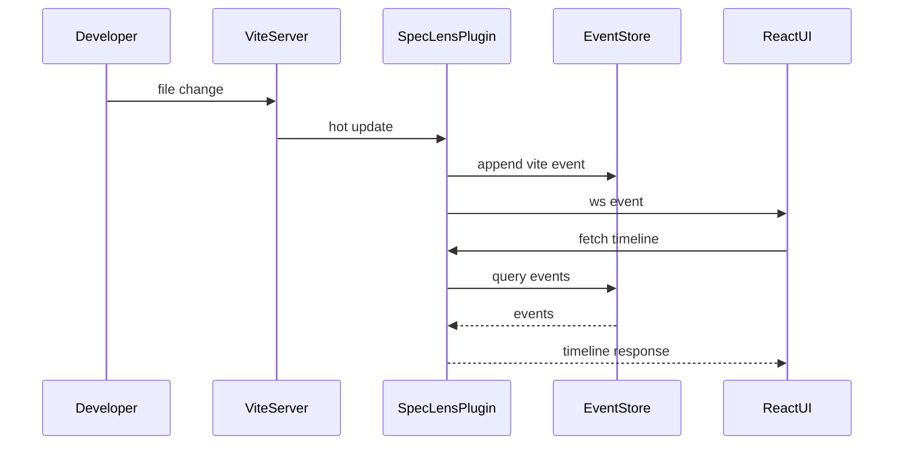
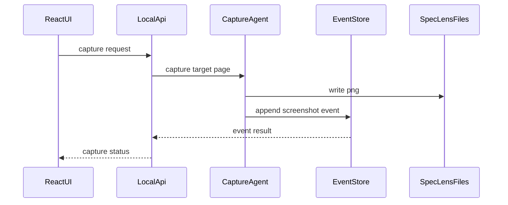
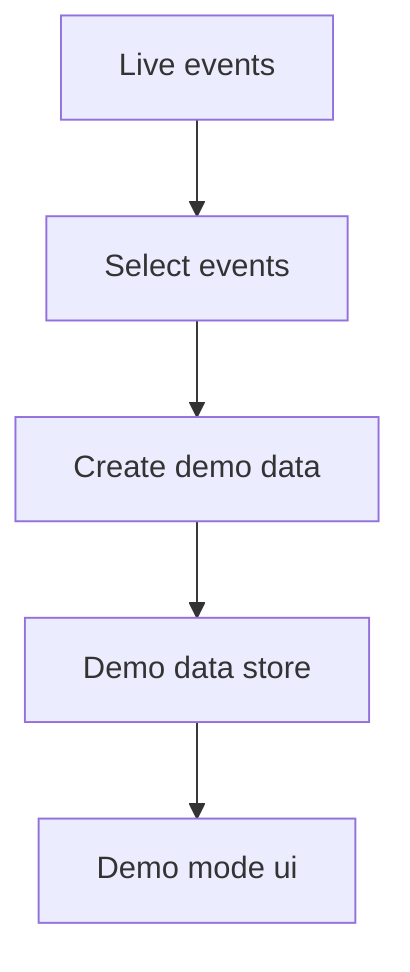
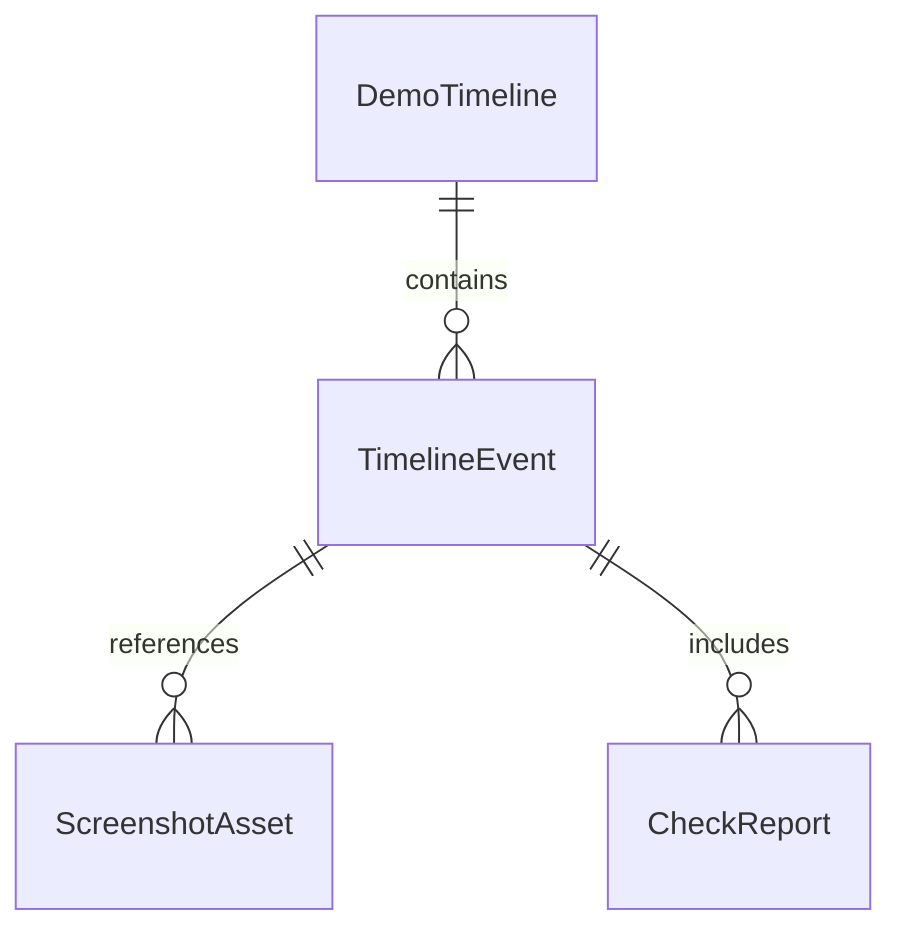

# Design Document: spec-lens-timeline

## Overview
SpecLens Timelineは、cc-sddでの開発過程をローカルに記録し、発表者があとからストーリーとして見返せるReact/Viteアプリである。対象ユーザーは主に発表者本人で、仕様更新、タスク進行、Vite開発イベント、検証結果、意思決定、スクリーンショットを1つの時系列に統合する。

この設計では、Vite dev server pluginを記録入口にし、ローカルAPI、WebSocket、ファイルウォッチ、HMRイベントを扱う。UIはReact SPAとして実装し、イベントログとスクリーンショットを`.spec-lens/`から読み込む。発表用に固定するデモデータは`demo-data/spec-lens/`へ分離する。

発表では、このアプリ自身をcc-sddで作る過程を題材として使う。したがって設計上は「アプリ利用者に提供する価値」と「発表で見せるデモ素材」を分けて扱う。

### Goals
- cc-sdd、Vite、スクリーンショット、検証、意思決定のイベントをローカルタイムラインとして保存・閲覧できる。
- ViteのHMRやdev serverイベントを、アプリ価値に直結する観測データとして扱う。
- `.kiro/specs/`、`.spec-lens/`、`demo-data/spec-lens/`の責務を分離し、仕様文書の肥大化を防ぐ。
- 初期版はログイン、クラウド同期、完全な過去実行再現、AI採点なしで成立させる。

### Non-Goals
- クラウド同期、共有URL、ログイン、チーム権限管理。
- 過去バージョンのアプリを操作可能な状態で再実行する機能。
- AIによるコード品質採点、設計品質評価、要約生成。
- 複数リポジトリ横断分析。
- Vite以外のビルドツールや開発サーバーへの初期対応。

## Boundary Commitments

### This Spec Owns
- ローカル開発イベントを`TimelineEvent`として正規化し、`.spec-lens/`に保存する。
- Vite dev serverからHMR、フルリロード、エラー、ファイル変更を観測する。
- cc-sdd関連ファイル、タスク状態、検証結果、意思決定をタイムラインイベントとして扱う。
- PlaywrightベースのローカルCapture Agentでスクリーンショットを保存する。
- React UIでタイムライン、フィルタ、検索、詳細、スクリーンショット、チェック結果、デモデータを表示する。
- ライブ記録と発表用サンプルデータの境界をUIと保存先で明示する。

### Out of Boundary
- `.kiro`の仕様承認ワークフローそのものを置き換えること。
- GitHub、Slack、外部AI、クラウドストレージなど外部サービス連携。
- ユーザー認証、共有リンク、チーム権限。
- 実装中アプリの過去バージョンをビルド・起動して操作可能にすること。
- AI採点やAI要約。

### Allowed Dependencies
- Vite 8系のPlugin API、HMR API、dev server WebSocket。
- React 19.2系のSPA UI。
- TypeScript 5系の型システム。
- Playwrightのローカルブラウザ制御とスクリーンショットAPI。
- Node.jsのローカルファイルシステムアクセス。
- `.kiro/specs/`、`.kiro/steering/`、`.agents/`などプロジェクト内のcc-sddファイル。

### Revalidation Triggers
- `TimelineEvent`、`ScreenshotAsset`、`CheckReport`のschema変更。
- `.spec-lens/`または`demo-data/spec-lens/`の保存形式変更。
- Vite plugin hook、custom WebSocket event、ローカルAPIの契約変更。
- Capture Agentの起動条件、対象URL、画像保存先の変更。
- requirementsのOut of scopeにあるクラウド、ログイン、完全再現、AI採点を取り込む変更。

## Architecture

### Existing Architecture Analysis
現在はReact/Viteアプリ本体が存在しないグリーンフィールドである。既存の基盤は、cc-sdd用の`.agents/`、テンプレートの`.kiro/settings/`、仕様の`.kiro/specs/spec-lens-timeline/`のみである。`.kiro/steering/`は未作成のため、設計内のBoundary CommitmentsとFile Structure Planを実装時の主要な判断基準にする。

### Architecture Pattern & Boundary Map
**Selected pattern**: Vite plugin centered local tool。Vite pluginがイベント収集、ローカルAPI、WebSocket、ファイル保存を担い、React UIが閲覧と操作を担う。ドメイン型と保存契約を中心にし、Vite依存を`plugins/spec-lens/`へ閉じ込める。



**Dependency direction**: `shared/types` → `plugins/spec-lens/server` → `plugins/spec-lens/vitePlugin` → `src/features` → `src/app`. UIはローカルAPIを通じてデータを取得し、server実装を直接importしない。

**Boundary decision**: Vite依存、Playwright依存、ファイルシステム依存はUIから隔離する。UIは`TimelineApiClient`と型付きDTOだけを扱う。

### Technology Stack

| Layer | Choice / Version | Role in Feature | Notes |
|-------|------------------|-----------------|-------|
| Frontend | React 19.2系 + TypeScript 5系 | タイムライン、検索、詳細、スクリーンショット表示 | SSRは使わない |
| Build and Dev Runtime | Vite 8系 | dev server、HMR、plugin実行基盤 | Plugin APIとHMR APIを使用 |
| Local Backend | Vite plugin middleware | ローカルAPI、イベント記録、WebSocket連携 | production serverは持たない |
| Data Storage | NDJSON + JSON manifest + PNG | `.spec-lens/`と`demo-data/spec-lens/`のローカル保存 | DBは使わない |
| Screenshot | Playwright | 自動・手動スクリーンショット保存 | ローカル実行のみ |
| Testing | Vitest + React Testing Library + Playwright | unit、integration、E2E | 実装時に追加 |

## File Structure Plan

### Directory Structure
```text
index.html
vite.config.ts
package.json
tsconfig.json
src/
├── main.tsx
├── App.tsx
├── app/
│   ├── routes.tsx
│   └── AppShell.tsx
├── features/
│   ├── timeline/
│   │   ├── TimelinePage.tsx
│   │   ├── TimelineList.tsx
│   │   ├── TimelineFilters.tsx
│   │   ├── EventDetailPanel.tsx
│   │   ├── ScreenshotPreview.tsx
│   │   ├── timelineApiClient.ts
│   │   ├── timelineSelectors.ts
│   │   └── timelineTypes.ts
│   ├── checks/
│   │   ├── CheckPanel.tsx
│   │   └── checkTypes.ts
│   ├── demo-data/
│   │   ├── DemoDataSwitcher.tsx
│   │   └── demoDataTypes.ts
│   └── recorder-status/
│       ├── RecorderStatusBadge.tsx
│       └── recorderStatusTypes.ts
├── shared/
│   ├── result.ts
│   ├── json.ts
│   └── time.ts
└── styles/
    └── global.css
plugins/
└── spec-lens/
    ├── vitePlugin.ts
    ├── client/
    │   └── hmrClient.ts
    └── server/
        ├── apiRouter.ts
        ├── captureAgent.ts
        ├── demoDataManager.ts
        ├── eventStore.ts
        ├── fileWatchRecorder.ts
        ├── ruleCheckEngine.ts
        ├── timelineQueryService.ts
        ├── viteEventRecorder.ts
        └── serverTypes.ts
shared/
└── spec-lens/
    ├── events.ts
    ├── schemas.ts
    └── paths.ts
demo-data/
└── spec-lens/
    ├── events.sample.ndjson
    └── screenshots/
```

### Modified Files
- `package.json` — React/Vite/TypeScript/Playwright/Vitest scripts and dependenciesを追加する。
- `.gitignore` — `.spec-lens/`は維持し、必要に応じてPlaywright出力やcoverageを追加する。
- `.kiro/specs/spec-lens-timeline/spec.json` — design生成時にphaseとapproval metadataを更新する。

### Component to File Mapping
- `SpecLensVitePlugin` — `plugins/spec-lens/vitePlugin.ts`
- `LocalApiRouter` — `plugins/spec-lens/server/apiRouter.ts`
- `EventStore` — `plugins/spec-lens/server/eventStore.ts`
- `ScreenshotCaptureAgent` — `plugins/spec-lens/server/captureAgent.ts`
- `RuleCheckEngine` — `plugins/spec-lens/server/ruleCheckEngine.ts`
- `DemoDataManager` — `plugins/spec-lens/server/demoDataManager.ts`
- `TimelineQueryService` — `plugins/spec-lens/server/timelineQueryService.ts`
- `ViteEventRecorder` — `plugins/spec-lens/server/viteEventRecorder.ts`
- `FileWatchRecorder` — `plugins/spec-lens/server/fileWatchRecorder.ts`
- `RecorderStatusClient` — `plugins/spec-lens/client/hmrClient.ts` and `src/features/recorder-status/RecorderStatusBadge.tsx`
- `TimelineUI` — `src/features/timeline/*`
- `CheckUI` — `src/features/checks/*`
- `DemoDataUI` — `src/features/demo-data/*`

## System Flows

### Viteイベント記録


### スクリーンショット保存


### 発表用デモデータ作成


## Requirements Traceability

| Requirement | Summary | Components | Interfaces | Flows |
|-------------|---------|------------|------------|-------|
| 1.1 | タイムライン初期表示 | TimelineUI, TimelineQueryService | Timeline API | Viteイベント記録 |
| 1.2 | 空状態案内 | TimelineUI | UI state |  |
| 1.3 | 種別フィルタ | TimelineUI, TimelineQueryService | Query params |  |
| 1.4 | イベント詳細 | TimelineUI | TimelineEvent DTO |  |
| 1.5 | イベント種別表示 | TimelineUI, EventStore | TimelineEvent kind |  |
| 2.1 | 仕様ファイル更新記録 | FileWatchRecorder, EventStore | File event | Viteイベント記録 |
| 2.2 | タスク状態表示 | FileWatchRecorder, TimelineUI | Task event |  |
| 2.3 | 検証結果表示 | RuleCheckEngine, TimelineUI | CheckReport |  |
| 2.4 | 意思決定記録 | LocalApiRouter, EventStore, TimelineUI | Decision event |  |
| 2.5 | 未紐付けイベント | EventStore, TimelineUI | nullable refs |  |
| 3.1 | HMRとreload記録 | ViteEventRecorder, EventStore | Vite event | Viteイベント記録 |
| 3.2 | 更新所要時間表示 | ViteEventRecorder, TimelineUI | durationMs | Viteイベント記録 |
| 3.3 | 不足詳細の明示 | ViteEventRecorder, TimelineUI | unknown fields |  |
| 3.4 | エラー表示継続 | ViteEventRecorder, TimelineUI | error event |  |
| 3.5 | 記録停止状態 | SpecLensVitePlugin, RecorderStatusClient | recorder state |  |
| 4.1 | 重要イベントの自動撮影 | ScreenshotCaptureAgent, EventStore | capture trigger | スクリーンショット保存 |
| 4.2 | 手動撮影 | TimelineUI, LocalApiRouter, ScreenshotCaptureAgent | capture API | スクリーンショット保存 |
| 4.3 | 画像プレビュー | TimelineUI | ScreenshotAsset |  |
| 4.4 | 撮影失敗表示 | ScreenshotCaptureAgent, TimelineUI | capture error | スクリーンショット保存 |
| 4.5 | 画像なし表示 | TimelineUI | optional screenshotIds |  |
| 5.1 | Project Memory分離 | EventStore, File Structure | path contract |  |
| 5.2 | `.spec-lens/`保存 | EventStore, ScreenshotCaptureAgent | storage paths |  |
| 5.3 | Markdown非埋め込み | EventStore | file policy |  |
| 5.4 | demo-data分離 | DemoDataManager | export contract | 発表用デモデータ作成 |
| 5.5 | 保存失敗表示 | EventStore, TimelineUI | storage error |  |
| 6.1 | 簡易チェック実行 | RuleCheckEngine, CheckUI | check API |  |
| 6.2 | チェック状態付与 | RuleCheckEngine | CheckStatus |  |
| 6.3 | 判定理由表示 | CheckUI | CheckReport |  |
| 6.4 | 対象なしskip | RuleCheckEngine | skipped status |  |
| 6.5 | AI採点ではない表示 | CheckUI | label policy |  |
| 7.1 | サンプルタイムライン表示 | DemoDataManager, DemoDataUI | demo mode | 発表用デモデータ作成 |
| 7.2 | サンプル画像表示 | DemoDataManager, TimelineUI | ScreenshotAsset |  |
| 7.3 | 画像欠落表示 | DemoDataManager, TimelineUI | missing asset |  |
| 7.4 | ライブからサンプル作成 | DemoDataManager | export API | 発表用デモデータ作成 |
| 7.5 | 表示モード明示 | DemoDataUI, TimelineUI | source mode |  |
| 8.1 | ログインなし | AppShell | local app state |  |
| 8.2 | 外部送信なし | LocalApiRouter, EventStore | local-only policy |  |
| 8.3 | 非対応説明 | AppShell, TimelineUI | unsupported action copy |  |
| 8.4 | 完全再現非対応説明 | TimelineUI | capability notice |  |
| 8.5 | 複数repo非対応 | AppShell | scope notice |  |
| 9.1 | テキスト先行表示 | TimelineUI | lazy image loading |  |
| 9.2 | 破損イベント隔離 | EventStore, TimelineUI | corrupt event |  |
| 9.3 | 検索 | TimelineQueryService, TimelineUI | search query |  |
| 9.4 | 目印表示 | TimelineUI, EventStore | marker field |  |
| 9.5 | 現在状態表示 | RecorderStatusClient, TimelineUI | recorder state |  |

## Components and Interfaces

| Component | Domain/Layer | Intent | Req Coverage | Key Dependencies | Contracts |
|-----------|--------------|--------|--------------|------------------|-----------|
| SpecLensVitePlugin | Runtime | Vite dev serverへ記録機能を組み込む | 3.1, 3.5, 8.2 | Vite P0, LocalApiRouter P0 | Service, Event |
| LocalApiRouter | Runtime | UI向けローカルAPIを提供する | 1.1, 2.4, 4.2, 7.4 | EventStore P0 | API |
| EventStore | Data | イベントと参照情報を保存・読込する | 1.1, 5.2, 9.2 | File system P0 | Service, State |
| ScreenshotCaptureAgent | Runtime | Playwrightで画面画像を保存する | 4.1, 4.2, 4.4 | Playwright P1, EventStore P0 | Service |
| RuleCheckEngine | Domain | 仕様とタスクの簡易チェックを生成する | 6.1, 6.2, 6.4 | EventStore P1 | Service |
| DemoDataManager | Data | ライブ記録から発表用サンプルを作る | 7.1, 7.4, 7.5 | EventStore P0 | Service, Batch |
| TimelineQueryService | Domain | フィルタ、検索、並び替えを提供する | 1.3, 9.3 | EventStore P0 | Service |
| ViteEventRecorder | Runtime | HMR、reload、errorをイベント化する | 3.1, 3.2, 3.3, 3.4 | Vite P0 | Event |
| FileWatchRecorder | Runtime | cc-sdd関連ファイル変更をイベント化する | 2.1, 2.2, 2.5 | Vite watcher P1 | Event |
| TimelineUI | UI | タイムライン閲覧と詳細表示を担う | 1, 4.3, 5.5, 9 | TimelineApiClient P0 | State |
| CheckUI | UI | 簡易チェック結果を表示する | 6.1, 6.3, 6.5 | RuleCheckEngine API P0 | State |
| DemoDataUI | UI | ライブとサンプルデータを切り替える | 7.1, 7.5 | DemoDataManager API P0 | State |
| RecorderStatusClient | Client | 記録中、停止中、エラー中を表示する | 3.5, 9.5 | Vite WS P1 | Event, State |

### Shared Types

#### TimelineEvent Model
```typescript
type EventKind =
  | 'cc_sdd_file'
  | 'task_state'
  | 'verification'
  | 'decision'
  | 'vite_hmr'
  | 'vite_reload'
  | 'vite_error'
  | 'screenshot'
  | 'check_result'
  | 'demo_marker'
  | 'corrupt';

type EventSeverity = 'info' | 'success' | 'warning' | 'error';

interface EventEnvelope<TPayload extends JsonObject> {
  id: string;
  schemaVersion: 1;
  kind: EventKind;
  occurredAt: string;
  source: 'cc_sdd' | 'vite' | 'user' | 'capture' | 'check' | 'demo' | 'system';
  severity: EventSeverity;
  title: string;
  summary?: string;
  relatedPaths: string[];
  specRef?: string;
  taskRef?: string;
  screenshotIds: string[];
  marker?: 'presentation' | 'important';
  payload: TPayload;
}
```

`JsonObject`は`shared/json.ts`で定義する。`any`は使わない。

### Runtime Layer

#### SpecLensVitePlugin
| Field | Detail |
|-------|--------|
| Intent | Vite dev serverに記録機能、ローカルAPI、WebSocket通知を組み込む |
| Requirements | 3.1, 3.5, 8.2, 9.5 |

**Responsibilities & Constraints**
- `configureServer`で`LocalApiRouter`、watcher、WebSocket handlersを登録する。
- `handleHotUpdate`でVite更新イベントを`ViteEventRecorder`へ渡す。
- 外部ネットワークへイベントや画像を送信しない。
- UIはserver実装を直接importせず、HTTP APIまたはWebSocketイベントだけを使う。

**Dependencies**
- External: Vite Plugin API — dev server hooks (P0)
- Outbound: LocalApiRouter — API registration (P0)
- Outbound: ViteEventRecorder — HMR event normalization (P0)

**Contracts**: Service [x] / API [ ] / Event [x] / Batch [ ] / State [ ]

##### Service Interface
```typescript
interface SpecLensPluginOptions {
  enabled: boolean;
  dataDir: string;
  demoDataDir: string;
  captureTargetUrl?: string;
  autoCapture: boolean;
}

function specLensPlugin(options: SpecLensPluginOptions): import('vite').Plugin;
```
- Preconditions: Vite dev server modeで利用する。
- Postconditions: ローカルAPIと記録イベントが登録される。
- Invariants: `dataDir`は`.spec-lens/`配下を既定値にする。

##### Event Contract
- Published events: `spec-lens:recorded`, `spec-lens:status`, `spec-lens:capture-result`
- Subscribed events: `spec-lens:manual-decision`, `spec-lens:manual-capture`
- Ordering: 同一process内ではappend順。永続化順を`occurredAt`と`id`で補正する。

**Implementation Notes**
- Integration: `vite.config.ts`でReact pluginと並べて登録する。
- Validation: dev server起動時に`.spec-lens/`の書き込み可否を確認する。
- Risks: build時には`configureServer`が動かないため、plugin側でdev-only guardを置く。

#### LocalApiRouter
| Field | Detail |
|-------|--------|
| Intent | React UIから利用するローカルHTTP APIを提供する |
| Requirements | 1.1, 1.3, 2.4, 4.2, 6.1, 7.4 |

**Responsibilities & Constraints**
- `/__spec-lens/api/events`でタイムライン取得と意思決定登録を提供する。
- `/__spec-lens/api/capture`で手動スクリーンショットを要求する。
- `/__spec-lens/api/checks/run`で簡易チェックを実行する。
- `/__spec-lens/api/demo/export`で発表用データを作成する。
- ローカルdev server内のAPIに限定し、認証や外部公開は扱わない。

**Dependencies**
- Inbound: TimelineApiClient — UI requests (P0)
- Outbound: EventStore — read and append (P0)
- Outbound: ScreenshotCaptureAgent — manual capture (P1)
- Outbound: RuleCheckEngine — check execution (P1)
- Outbound: DemoDataManager — demo export (P1)

**Contracts**: Service [ ] / API [x] / Event [ ] / Batch [ ] / State [ ]

##### API Contract
| Method | Endpoint | Request | Response | Errors |
|--------|----------|---------|----------|--------|
| GET | `/__spec-lens/api/events` | `TimelineQuery` | `TimelineResponse` | 400, 500 |
| POST | `/__spec-lens/api/events/decision` | `CreateDecisionRequest` | `EventEnvelope<DecisionPayload>` | 400, 500 |
| POST | `/__spec-lens/api/capture` | `CaptureRequest` | `CaptureResponse` | 409, 500 |
| POST | `/__spec-lens/api/checks/run` | `RunChecksRequest` | `CheckReport` | 500 |
| POST | `/__spec-lens/api/demo/export` | `DemoExportRequest` | `DemoExportResult` | 400, 500 |

**Implementation Notes**
- Integration: Connect middlewareでJSON request/responseを扱う。
- Validation: request bodyはruntime validatorで検証する。
- Risks: dev serverと同一originに限定し、CORSを広げない。

#### ViteEventRecorder
| Field | Detail |
|-------|--------|
| Intent | Vite HMR、full reload、errorをTimelineEventへ変換する |
| Requirements | 3.1, 3.2, 3.3, 3.4 |

**Responsibilities & Constraints**
- `handleHotUpdate`入力から変更ファイル、影響モジュール、timestampを取り出す。
- 所要時間が取れない場合は`payload.durationMs`を未設定にする。
- エラー情報は概要と重大度のみを保存し、過剰な環境情報をUIへ出さない。

**Contracts**: Event [x]

##### Event Contract
- Published events: `vite_hmr`, `vite_reload`, `vite_error`
- Payload: `changedPath`, `affectedModules`, `durationMs?`, `message?`
- Delivery: EventStoreへappend後、UIへ`spec-lens:recorded`を送る。

#### FileWatchRecorder
| Field | Detail |
|-------|--------|
| Intent | cc-sdd関連ファイル変更をTimelineEventへ変換する |
| Requirements | 2.1, 2.2, 2.5 |

**Responsibilities & Constraints**
- `.kiro/specs/**`、`.kiro/steering/**`、必要に応じて`.agents/**`の変更を監視する。
- 仕様、設計、タスク、検証レポートの種別をパスから分類する。
- 特定taskへ紐付けられない場合は`taskRef`なしで保存する。

**Contracts**: Event [x]

### Data and Domain Layer

#### EventStore
| Field | Detail |
|-------|--------|
| Intent | イベント、スクリーンショット参照、破損行情報を保存・読込する |
| Requirements | 1.1, 1.5, 4.5, 5.1, 5.2, 5.3, 5.5, 9.2, 9.4 |

**Responsibilities & Constraints**
- `.spec-lens/events.ndjson`へイベントをappendする。
- `.spec-lens/screenshots/`へ画像ファイル参照を保持する。
- 破損したNDJSON行は`corrupt`イベントとして隔離し、読み取れるイベントを返す。
- 仕様Markdown本文へスクリーンショットやログを埋め込まない。

**Dependencies**
- Outbound: Node file system — local persistence (P0)
- Inbound: LocalApiRouter, recorders, RuleCheckEngine, DemoDataManager (P0)

**Contracts**: Service [x] / State [x]

##### Service Interface
```typescript
interface EventStore {
  appendEvent<TPayload extends JsonObject>(
    event: EventEnvelope<TPayload>
  ): Promise<Result<EventEnvelope<TPayload>, StorageError>>;
  queryEvents(query: TimelineQuery): Promise<Result<TimelineResponse, StorageError>>;
  getEvent(id: string): Promise<Result<EventEnvelope<JsonObject> | null, StorageError>>;
}
```
- Preconditions: `dataDir`が設定済み。
- Postconditions: append成功時はNDJSONへ1行追加される。
- Invariants: 保存形式はUTF-8 NDJSON。画像はMarkdownに埋め込まない。

##### State Management
- State model: append-only event log。
- Persistence: `.spec-lens/events.ndjson`と`.spec-lens/manifest.json`。
- Concurrency strategy: 単一process内のappend queueで順序を安定させる。

#### TimelineQueryService
| Field | Detail |
|-------|--------|
| Intent | 検索、フィルタ、並び替え、画像lazy load用のDTOを作る |
| Requirements | 1.1, 1.3, 1.4, 9.1, 9.3 |

**Contracts**: Service [x]

##### Service Interface
```typescript
interface TimelineQueryService {
  search(query: TimelineQuery): Promise<Result<TimelineResponse, QueryError>>;
}
```
- Preconditions: EventStoreが読み取り可能。
- Postconditions: テキスト情報は画像読み込みを待たずに返す。
- Invariants: 検索対象はtitle、summary、kind、relatedPaths、taskRef、specRef。

#### RuleCheckEngine
| Field | Detail |
|-------|--------|
| Intent | 仕様ファイル、タスク、検証の簡易チェック結果を生成する |
| Requirements | 2.3, 6.1, 6.2, 6.3, 6.4, 6.5 |

**Responsibilities & Constraints**
- ルールベースチェックのみを行い、AI採点として表示しない。
- 対象ファイルがない場合は`skipped`にする。
- チェック結果は`check_result`イベントとして保存できる。

**Contracts**: Service [x]

##### Service Interface
```typescript
type CheckStatus = 'success' | 'warning' | 'failure' | 'skipped';

interface RuleCheckEngine {
  run(input: RunChecksRequest): Promise<Result<CheckReport, CheckError>>;
}
```
- Preconditions: project rootが指定されている。
- Postconditions: 各check itemにstatus、reason、relatedPathが付与される。
- Invariants: AI、外部API、クラウドへ依存しない。

#### DemoDataManager
| Field | Detail |
|-------|--------|
| Intent | ライブ記録から発表用固定データを作成し、読み込む |
| Requirements | 5.4, 7.1, 7.2, 7.3, 7.4, 7.5 |

**Contracts**: Service [x] / Batch [x]

##### Service Interface
```typescript
interface DemoDataManager {
  exportSelection(request: DemoExportRequest): Promise<Result<DemoExportResult, DemoDataError>>;
  loadDemoTimeline(): Promise<Result<TimelineResponse, DemoDataError>>;
}
```
- Preconditions: export対象イベントIDが存在する。
- Postconditions: `demo-data/spec-lens/`にイベントと関連画像が分離保存される。
- Invariants: ライブ記録を上書きしない。

##### Batch / Job Contract
- Trigger: ユーザーの発表用データ作成操作。
- Input: event IDs、includeScreenshots flag。
- Output: `demo-data/spec-lens/events.sample.ndjson`、画像コピー。
- Idempotency: 同じexport nameでは上書き確認を要求する。

### Capture Layer

#### ScreenshotCaptureAgent
| Field | Detail |
|-------|--------|
| Intent | Playwrightで対象ページのスクリーンショットを保存する |
| Requirements | 4.1, 4.2, 4.3, 4.4 |

**Responsibilities & Constraints**
- auto capture対象イベントまたは手動capture requestを受けて画像を保存する。
- Playwrightが利用できない場合は失敗イベントを保存する。
- 画像パスは`ScreenshotAsset`としてイベントへ関連付ける。

**Dependencies**
- External: Playwright — browser screenshot (P1)
- Outbound: EventStore — screenshot event append (P0)
- Outbound: Node file system — PNG write (P0)

**Contracts**: Service [x]

##### Service Interface
```typescript
interface ScreenshotCaptureAgent {
  capture(request: CaptureRequest): Promise<Result<CaptureResponse, CaptureError>>;
}
```
- Preconditions: `captureTargetUrl`が設定され、対象ページへアクセスできる。
- Postconditions: 成功時はPNGと`screenshot`イベントが保存される。
- Invariants: 失敗しても元のイベント記録は継続する。

### UI Layer

#### TimelineUI
| Field | Detail |
|-------|--------|
| Intent | タイムライン閲覧、検索、詳細、スクリーンショット表示を提供する |
| Requirements | 1.1, 1.2, 1.3, 1.4, 1.5, 4.3, 4.5, 5.5, 8.4, 9.1, 9.2, 9.3, 9.4, 9.5 |

**Implementation Notes**
- Integration: `timelineApiClient.ts`経由でLocalApiRouterへアクセスする。
- Validation: 空状態、画像なし、破損イベント、保存失敗を表示できること。
- Risks: 画像読み込みでUIが重くならないよう、一覧ではthumbnailまたはlazy loadにする。

#### CheckUI
| Field | Detail |
|-------|--------|
| Intent | ルールベースの簡易チェック結果を表示する |
| Requirements | 6.1, 6.3, 6.5 |

**Implementation Notes**
- 「AI採点」ではなく「ルールベースチェック」と明記する。
- 判定理由と関連ファイルを表示する。

#### DemoDataUI
| Field | Detail |
|-------|--------|
| Intent | ライブ記録と発表用サンプルの表示モードを切り替える |
| Requirements | 7.1, 7.5 |

**Implementation Notes**
- 現在の表示元を常に表示する。
- demo modeではライブ記録への書き込み操作を抑制する。

#### RecorderStatusClient
| Field | Detail |
|-------|--------|
| Intent | 記録中、停止中、エラー中をUIへ反映する |
| Requirements | 3.5, 9.5 |

**Implementation Notes**
- `spec-lens:status` WebSocket eventを購読する。
- WebSocket未接続時は`unknown`状態として表示する。

## Data Models

### Domain Model
- `TimelineEvent`: タイムライン上の最小表示単位。
- `ScreenshotAsset`: 画像ファイルとイベントの関連情報。
- `CheckReport`: ルールベースチェックの実行結果。
- `DemoTimeline`: 発表用に固定されたイベント集合。
- `RecorderStatus`: `recording`、`paused`、`error`、`unknown`。



### Logical Data Model

**TimelineEvent**
- `id: string`
- `schemaVersion: 1`
- `kind: EventKind`
- `occurredAt: string`
- `source: EventSource`
- `severity: EventSeverity`
- `title: string`
- `summary?: string`
- `relatedPaths: string[]`
- `specRef?: string`
- `taskRef?: string`
- `screenshotIds: string[]`
- `marker?: 'presentation' | 'important'`
- `payload: JsonObject`

**ScreenshotAsset**
- `id: string`
- `eventId: string`
- `path: string`
- `capturedAt: string`
- `width?: number`
- `height?: number`
- `status: 'available' | 'missing' | 'failed'`
- `errorMessage?: string`

**CheckReport**
- `id: string`
- `eventId: string`
- `runAt: string`
- `items: CheckItem[]`

**CheckItem**
- `id: string`
- `label: string`
- `status: 'success' | 'warning' | 'failure' | 'skipped'`
- `reason: string`
- `relatedPaths: string[]`

### Physical Data Model
```text
.spec-lens/
├── events.ndjson
├── manifest.json
├── screenshots/
│   └── yyyy-mm-dd/
│       └── screenshot-id.png
├── reports/
│   └── check-report-id.json
└── snapshots/

demo-data/
└── spec-lens/
    ├── events.sample.ndjson
    ├── manifest.sample.json
    └── screenshots/
```

`events.ndjson`はappend-onlyとし、破損行は読み込み時に`corrupt`イベントへ変換する。`manifest.json`はschema version、last compaction、known assetsを保持する。

## Error Handling

### Error Strategy
- 保存失敗、撮影失敗、破損イベント、API validation errorをユーザーに表示可能なイベントまたは状態として扱う。
- 一部失敗してもタイムライン閲覧を継続する。
- エラー種別はdiscriminated unionで定義し、`any`を使わない。

### Error Categories and Responses
- **User Errors**: 不正な検索条件、存在しないevent ID、未設定のcapture targetはUIで修正方法を表示する。
- **System Errors**: ファイル書き込み失敗、Playwright起動失敗、Vite WebSocket切断は`RecorderStatus`とエラーイベントで表示する。
- **Data Errors**: 破損NDJSON、欠落画像、schema mismatchは該当イベントを隔離し、他のイベント表示を継続する。

### Monitoring
初期版は外部監視を持たない。ローカルUI上の`RecorderStatusBadge`と`system` sourceのイベントで状態を確認する。

## Testing Strategy

### Unit Tests
- `EventStore`が正常なNDJSON行を読み込み、破損行を`corrupt`イベントとして返すこと。
- `TimelineQueryService`がkind、検索語、markerでフィルタできること。
- `RuleCheckEngine`が対象ファイルなしを`skipped`にし、AI採点として扱わないこと。
- `DemoDataManager`が選択イベントと関連画像だけを`demo-data/spec-lens/`へ分離すること。
- `TimelineUI`のselectorが画像読み込みを待たずにテキストイベントを返すこと。

### Integration Tests
- Vite pluginの`handleHotUpdate`相当入力から`vite_hmr`イベントが保存されること。
- LocalApiRouterの`POST /capture`がCapture Agent成功時に`screenshot`イベントを返すこと。
- Capture Agent失敗時に元イベント記録を壊さず、失敗状態を返すこと。
- FileWatchRecorderが`.kiro/specs/**`更新を`cc_sdd_file`イベントとして保存すること。
- Check実行APIが`CheckReport`と`check_result`イベントを生成すること。

### E2E/UI Tests
- 初回起動時、イベントなしの案内が表示されること。
- サンプルタイムラインを開くと、ライブ記録と区別されて表示されること。
- イベント種別フィルタと検索で表示対象が変わること。
- スクリーンショット付きイベントを選択すると画像プレビューが表示されること。
- 欠落画像または破損イベントがあっても他イベントを閲覧できること。

### Performance/Load
- 5,000件のイベントで初期表示時にテキスト情報を先に表示する。
- スクリーンショット画像は一覧で一括読み込みしない。
- 検索は初期版ではメモリ内で行い、10,000件を超える場合は将来のindex化を検討する。

## Security Considerations
- 初期版はログインなしのローカル専用ツールであり、外部サービスへイベントや画像を送信しない。
- ローカルAPIはVite dev server内に限定し、CORSを広げない。
- ファイルパスはproject root配下に正規化し、任意パス書き込みを防ぐ。
- イベントpayloadに秘密情報が入り得るため、UI上で外部送信機能を提供しない。

## Performance & Scalability
- `events.ndjson`はappend-onlyで実装し、MVPでは単一プロジェクト内のローカル利用に限定する。
- UIは画像lazy loadとテキスト先行表示で体感遅延を抑える。
- 大規模化した場合は、イベントcompaction、index file、日付別分割を追加する。

## Migration Strategy
初期版は新規導入のため既存データ移行はない。将来schema変更が発生した場合は、`schemaVersion`を上げ、旧versionの読み取り互換またはmigration scriptを別タスクで設計する。

## Supporting References
- 詳細な調査と意思決定は[research.md](/Users/murashigeryousuke/Documents/アプリ制作/my-app/.kiro/specs/spec-lens-timeline/research.md)に記録する。
